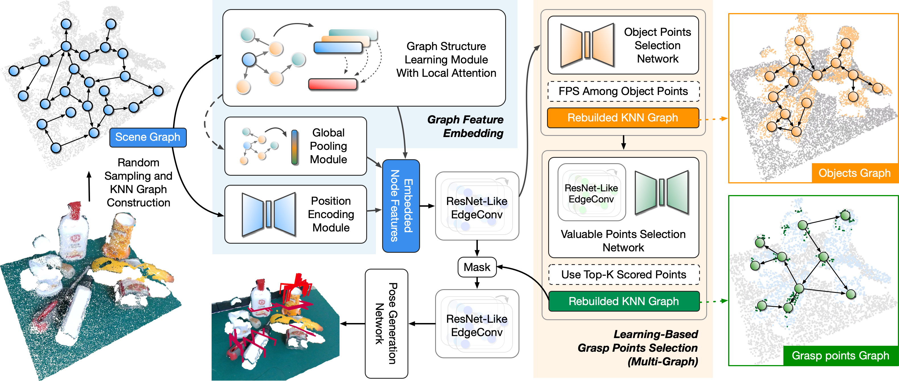

# GraNet
Official implementation for paper "**GraNet: A Multi-Level Graph Network for 6-DoF Grasp Pose Generation in Cluttered Scenes**" in IROS 2023.

[[paper](https://arxiv.org/abs/2312.03345)]



## Abstract

6-DoF object-agnostic grasping in unstructured environments is a critical yet challenging task in robotics. Most current works use non-optimized approaches to sample grasp locations and learn spatial features without concerning the grasping task. This paper proposes **GraNet**, a graph-based grasp pose generation framework that translates a point cloud scene into multi-level graphs and propagates features through graph neural networks. By building graphs at the *scene level*, *object level*, and *grasp point level*, GraNet enhances feature embedding at multiple scales while progressively converging to the ideal grasping locations by learning. Our pipeline can thus characterize the spatial distribution of grasps in cluttered scenes, leading to a higher rate of effective grasping. Furthermore, we enhance the representation ability of scalable graph networks by a structure-aware attention mechanism to exploit local relations in graphs. Our method achieves state-of-the-art performance on the large-scale GraspNet-1Billion benchmark, especially in grasping unseen objects (+11.62 AP). The real robot experiment shows a high success rate in grasping scattered objects, verifying the effectiveness of the proposed approach in unstructured environments.

## Requirements

- Python 3.7
- PyTorch 1.7.1 + cuda 11.0.211
- Dgl 0.7.2
- Open3d 0.14.1
- Tensorboard 2.8.0
- Numpy 1.21.2
- Scipy 1.7.3
- Pillow 8.4.0
- Tqdm 4.62.3

## Installation

1. Clone our repository.

   ```bash
   git clone https://github.com/wang-h-w/GraNet.git
   cd GraNet
   ```

2. Install all dependencies mentioned in *Requirements*.

3. Compile and install pointnet2 operators.

   ```bash
   cd pointnet2
   python setup.py install
   ```

4. Compile and install knn operators.

   ```bash
   cd knn
   python setup.py install
   ```

5. Install GraspNetAPI.

   ```bash
   git clone https://github.com/graspnet/graspnetAPI.git
   cd graspnetAPI
   pip install .
   ```

## Data Preparation

#### Download GraspNet-1Billion dataset

GraNet is trained and tested on GraspNet-1Billion dataset. You can download the dataset from [here](https://graspnet.net/datasets.html). You need to download the data from the following category on this page: Train Images, Test Images, 6 DoF Grasp Labels, Object 3D Models. All downloaded files are placed in the **DATASET_PATH** directory, which needs to be indicated for subsequent training and testing to find the data.

#### Generate label for GPS network learning

In GraNet, the GPS network (see the paper for details) is optimized to find out the high-value grasp points. From the training point of view, we need to provide the ground-truth grasping value of each point. Due to the limitation of computing power, we currently sample points in the scene and generate a dataset of the grasping values of these points. Running the following command will generate the **objectness_score** folder in the **DATASET_PATH** directory, where the grasping value data of each point is stored.

```bash
cd dataset
sh generate_score.sh
```

Note: `--points` refers to the number of points that generate grasping value, `--start` and `--end` specify the start and end scene for generating the label, which should be in the range 0-190 according to GraspNet-1Billion.

## Usage

#### Training

```bash
sh command_train.sh
```

#### Testing

```bash
sh command_test.sh
```

#### Demo

```bash
sh command_demo.sh
```

## Citation

If you find our work useful in your research, please consider citing: 

```
@inproceedings{wang2023granet,
  title={GraNet: A Multi-Level Graph Network for 6-DoF Grasp Pose Generation in Cluttered Scenes},
  author={Wang, Haowen and Niu, Wanhao and Zhuang, Chungang},
  booktitle={2023 IEEE/RSJ International Conference on Intelligent Robots and Systems (IROS)},
  year={2023},
  organization={IEEE}
}
```

